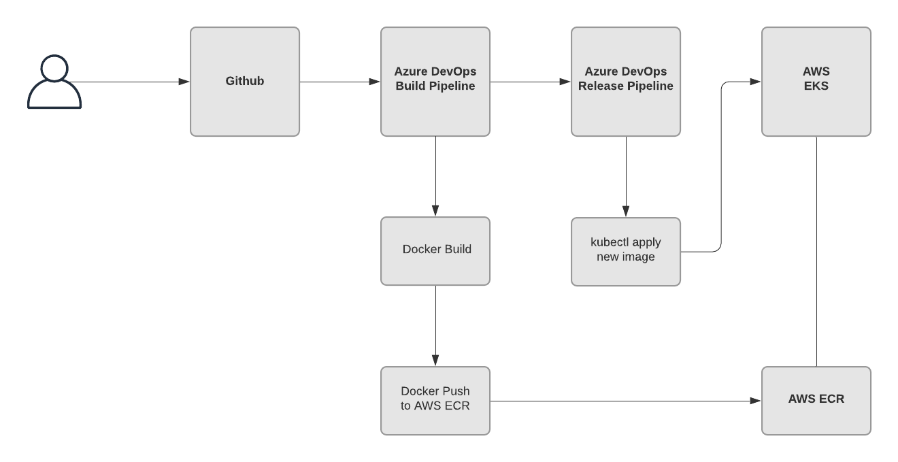

# azure-devops-aws-eks-demo

Azure Devops Build and Release Pipeline Demo to AWS EKS Demo. 

## Solution Overview
- Kubernetes Cluster: [AWS EKS](https://aws.amazon.com/eks/) deployed using [**eksctl**](https://docs.aws.amazon.com/eks/latest/userguide/getting-started-eksctl.html)
- CI/CD: Azure DevOps - 
- Source Code Management: [Github](https://github.com/ctaguinod/azure-devops-aws-eks-demo)
- Simple/Sample app from AWS (go lang)
- Docker Container Registry: [AWS ECR](https://aws.amazon.com/ecr/)
- EKS Cluster provisioned by following [EKS Workshop](https://www.eksdemo.com/) and [eksctl gettting started guide](https://docs.aws.amazon.com/eks/latest/userguide/getting-started-eksctl.html)

### Install Pre-requisites
- Install CLI tools:
    - `awscli`
    - `eksctl` 
    - `kubectl`
- Create IAM User with privilages to create and manage EKS cluster and configure aws cli with appropriate credential with `aws configure`

### Launch EKS Cluster using eksctl

- Generate yaml definition, more examples here https://github.com/weaveworks/eksctl/tree/master/examples

```
cat << EOF > eksdemo.yaml
---
apiVersion: eksctl.io/v1alpha5
kind: ClusterConfig

metadata:
  name: eksdemo-eksctl
  region: ap-southeast-1

managedNodeGroups:
- name: eksdemo-nodegroup
  instanceType: t3.medium
  desiredCapacity: 1
  minSize: 1
  maxSize: 3
  iam:
    withAddonPolicies:
      albIngress: true
      cloudWatch: true
      autoScaler: true

cloudWatch:
  clusterLogging:
    # all supported types: "api", "audit", "authenticator", "controllerManager", "scheduler"
    # supported special values: "*" and "all"
    enableTypes: ["*"]
EOF
```

- Launch cluster - `eksctl create cluster -f eksdemo.yaml`
- Verify cluster - `kubectl get nodes`
- Export the Worker Role Name

```
STACK_NAME=$(eksctl get nodegroup --cluster eksdemo-eksctl -o json | jq -r '.[].StackName')
ROLE_NAME=$(aws cloudformation describe-stack-resources --stack-name $STACK_NAME | jq -r '.StackResources[] | select(.ResourceType=="AWS::IAM::Role") | .PhysicalResourceId')
echo "export ROLE_NAME=${ROLE_NAME}" | tee -a ~/.bash_profile
```

- [Managing Node Groups](https://eksctl.io/usage/managing-nodegroups/)

```
eksctl get clusters
eksctl get nodegroups --cluster eksdemo-eksctl
eksctl scale nodegroup --cluster=eksdemo-eksctl --name=eksdemo-nodegroup --nodes=1 --nodes-min=1 --nodes-max=3  # scale/adjust nodes
```

## Configure Azure DevOps

1. Create Service Connection to AWS Account
2. Install [AWS Toolkit for Azure DevOps](https://marketplace.visualstudio.com/items?itemName=AmazonWebServices.aws-vsts-tools&targetId=f42bfb7d-8d11-429e-ab7c-4f326dd3c4c4&utm_source=vstsproduct&utm_medium=ExtHubManageList)

## Some Useful commands

### kubectl 
```
kubectl get nodes
kubectl get pods -o wide
kubectl get deployment hello-k8s -o wide
kubectl get services hello-k8s -o wide
```

### eksctl 
```

```
